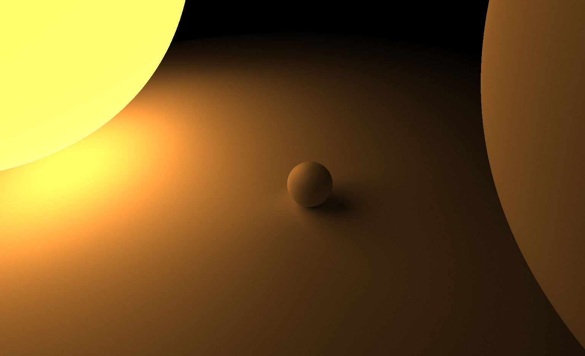

# Ray Tracing Engine

A real-time ray tracing engine built with C++ and Walnut UI framework. This project implements a physically-based renderer that simulates light behavior to create realistic images.

## Features

- Real-time ray tracing with progressive refinement
- Physically-based material system
- Interactive camera controls
- Sphere primitives with customizable properties
- Emissive materials for light sources
- Multi-threaded rendering for improved performance
- Interactive scene editor

## Technical Implementation

### Core Components

- **Renderer**: Handles ray generation, intersection testing, and shading
- **Camera**: Manages view transformation and ray direction calculation
- **Scene**: Contains all objects and materials in the 3D environment
- **Material System**: Defines surface properties including albedo, roughness, and emission

### Rendering Pipeline

1. Primary rays are generated from the camera for each pixel
2. Rays are tested for intersection with scene objects
3. Material properties determine how light interacts with surfaces
4. Multiple ray bounces simulate global illumination
5. Progressive rendering accumulates samples for noise reduction

### Performance Optimizations

- Parallel processing using std::execution
- Custom random number generation
- Frame accumulation for noise reduction
- Efficient ray-sphere intersection testing

## Controls

- **WASD**: Move camera position
- **Q/E**: Move camera up/down
- **Right Mouse Button + Mouse Movement**: Rotate camera
- **UI Controls**: Adjust scene objects and material properties

## Building the Project

### Prerequisites

- C++17 compatible compiler
- CMake 3.16 or higher
- Walnut UI framework and dependencies
